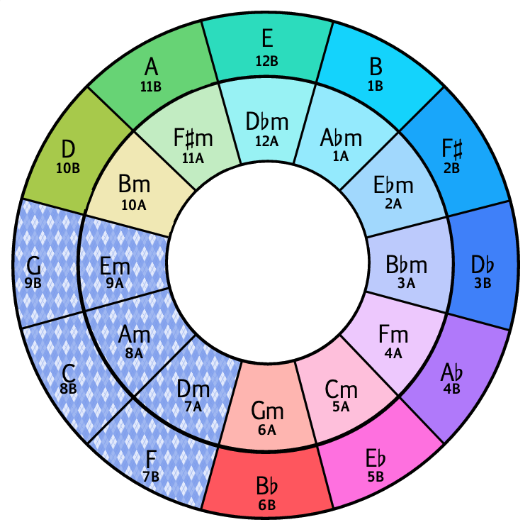
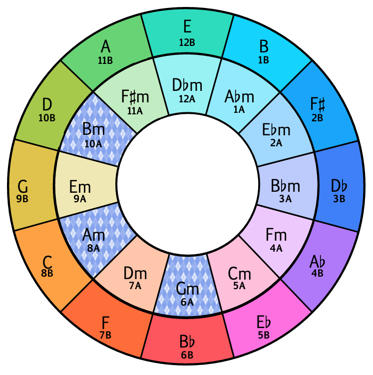
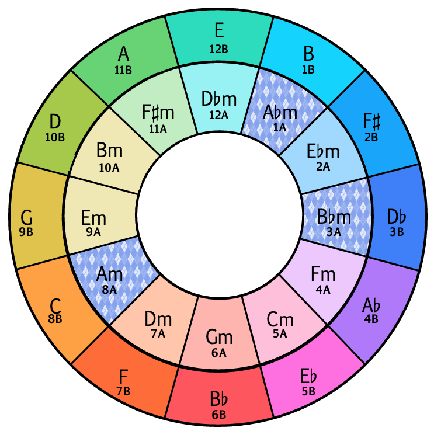

# Entropy

To be clear there are no hard and fast rules when DJing, and it's always left best to the ear what the next track should be. But the [Camelot Wheel](https://www.soulglo.com) is a quick guide of what track _could_ be played next.

### 0 - Single Key Mixing

If selecting A Minor as your starting key, you would only expect A minor tracks to be returned for the set.

### 1 - Main Key Group Mixing

The main group would include the keys immediately adjacent to the starting key and all the tracks returned would be from this group.

### 2 - Main Group Mixing

Same as above, but the main group would change as keys are changed. This allows movement around the wheel.

### 3 - Main and Semitone Key Mixing

Semitones are added as a possibility for the last key played. In the example below for A minor, B minor and G minor would also be included.

### 4 - Main, Semitone and Double Semitone Key Mixing

For the most dramatic changes in tone, movements around the wheel that are 7 or 5 fifths in difference can quite shift the mood of the dancefloor.

